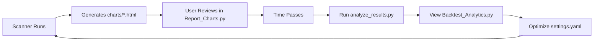

# 📈 Backtest System User Guide

## Overview

The backtesting system validates your scanner's historical performance by analyzing actual market outcomes of past suggestions. This helps you:

1. **Measure Algorithm Effectiveness**: Validate that high scores correlate with profitable outcomes
2. **Optimize Parameters**: Identify which settings produce the best hit rates
3. **Build Confidence**: See real-world results before deploying capital

## System Architecture

### Components

1. **`stock_scanner/analyze_results.py`** - Core analysis engine
2. **`pages/Backtest_Analytics.py`** - Interactive Streamlit dashboard
3. **`config/settings.yaml`** - Configuration (backtest section)
4. **`reports/backtest_summary.csv`** - Raw results data
5. **`reports/backtest_summary.md`** - Text summary

## Configuration (`config/settings.yaml`)

```yaml
backtest:
  target_profit: 0.05          # 5% profit target
  stop_loss: 0.03              # 3% stop-loss
  min_score_threshold: 60      # Only analyze scores >= 60
  output_csv: "reports/backtest_summary.csv"
  performance_window_days: 30  # Track for 30 days
```

### Key Parameters

- **target_profit**: The gain required for a "Success" outcome
- **stop_loss**: The loss that triggers a "Failure" outcome  
- **min_score_threshold**: Ignore low-quality signals below this score
- **performance_window_days**: How long to track each suggestion

## Running the Backtest

### Command Line

```bash
# Activate your virtual environment
source venv/bin/activate

# Run the backtest analysis
python stock_scanner/analyze_results.py
```

The script will:
1. Scan `reports/charts/` for all historical reports
2. Extract ticker, date, and score from filenames (e.g., `AAPL_2026-01-15_score_85.html`)
3. Fetch historical price data from the analysis date to present
4. Calculate max return, max drawdown, current return, and outcome
5. Determine index membership (S&P 500, NASDAQ, DOW)
6. Generate CSV and markdown summary

### Output

**Terminal Output:**
```
================================================================================
Starting Backtest Analysis
================================================================================
Found 65 reports with score >= 60
Analyzing 65 reports with 10 threads...
...
Hit Rate: 45.45% (using 5% target, 3% stop)
Avg Max Return: 2.74%
Score vs Return Correlation: -0.204
================================================================================
```

**Files Generated:**
- `reports/backtest_summary.csv` - Full dataset
- `reports/backtest_summary.md` - Text summary
- `backtest.log` - Detailed execution log

## Streamlit Dashboard

### Accessing

1. Ensure Streamlit is running: `streamlit run app.py`
2. Navigate to **Backtest Analytics** in the sidebar
3. If no data appears, run `python stock_scanner/analyze_results.py` first

### Features

#### 📊 Overview Tab
- **Outcome Distribution**: Pie chart showing Success/Failure/Pending breakdown
- **Performance by Index**: Compare S&P 500, NASDAQ, DOW hit rates
- **Return Distribution**: Histogram of max returns vs current returns

#### 🎯 Score Analysis Tab
- **Scatter Plot**: Score vs Max Return with color-coded outcomes
- **Correlation Metrics**: Quantify the predictive power of your scores
- **Box Plots**: Score distribution by outcome

**Key Insight**: A positive correlation (>0.3) means higher scores predict better returns. Negative correlation indicates the scoring algorithm needs refinement.

#### 📅 Time Series Tab
- **Rolling Hit Rate**: 30-day moving average of success rate
- **Cumulative Returns**: Simulated portfolio performance over time

#### 🏆 Performance Leaders Tab
- **Top 10 Winners**: Best max returns
- **Top 10 Losers**: Worst drawdowns
- **High Score Failures**: Investigate why high-score picks failed (score >= 85)

#### 📋 Raw Data Tab
- **Filterable Table**: Sort, filter, and export data
- **Download CSV**: Export filtered results for external analysis

### Filters (Sidebar)

- **Score Range**: Focus on specific score brackets
- **Outcome**: View only Success, Failure, or Pending trades
- **Index Membership**: Compare S&P 500 vs NASDAQ performance
- **Date Range**: Analyze specific time periods

## Metrics Explained

### Hit Rate
```
Hit Rate = (Successes / (Successes + Failures)) × 100%
```
**Example**: 10 successes, 12 failures → 10/22 = 45.45% hit rate

**Note**: Pending trades (neither hit target nor stop) are excluded from hit rate calculation.

### Max Return %
The highest price reached after the analysis date:
```
Max Return = ((Max Price - Entry Price) / Entry Price) × 100
```

### Max Drawdown %
The lowest price reached after the analysis date:
```
Max Drawdown = ((Min Price - Entry Price) / Entry Price) × 100
```
*Always negative for losing positions.*

### Current Return %
Performance as of the most recent market close:
```
Current Return = ((Current Price - Entry Price) / Entry Price) × 100
```

### Outcome Logic

```python
if price_hit_target_before_stop:
    outcome = "Success"
elif price_hit_stop_before_target:
    outcome = "Failure"
else:
    outcome = "Pending"  # Neither threshold reached
```

### Holding Days
Days from entry to exit (or current date for pending trades).

## Interpreting Results

### Strong System
✅ Hit Rate > 50%  
✅ Score Correlation > 0.3  
✅ Avg Score (Success) > Avg Score (Failure)  
✅ Max Return > (Target × 1.5)

### Weak System
⚠️ Hit Rate < 40%  
⚠️ Negative correlation  
⚠️ High-score failures common  
⚠️ Max Drawdown > Stop Loss

### Example Analysis

**Current Results (as of Jan 26, 2026):**
- Hit Rate: 45.45% ❌ (below 50%)
- Correlation: -0.204 ❌ (negative!)
- S&P 500 Hit Rate: 66.7% ✅ (good)
- NASDAQ Hit Rate: 36.4% ❌ (poor)

**Recommendations:**
1. **Score Algorithm Needs Revision**: Negative correlation means high scores don't predict success
2. **Focus on S&P 500**: 2x better performance vs NASDAQ
3. **Increase Min Score Threshold**: Try `min_score_threshold: 75` to filter marginal signals
4. **Adjust Weights in `settings.yaml`**: Increase `quality` weight, decrease `compression` weight

## Advanced Usage

### Custom Analysis Period

Edit the config to backtest only recent signals:

```yaml
backtest:
  performance_window_days: 7  # Short-term trades
```

Re-run: `python stock_scanner/analyze_results.py`

### Strategy Comparison

```bash
# Baseline
cp config/settings.yaml config/settings_baseline.yaml
python stock_scanner/analyze_results.py
mv reports/backtest_summary.csv reports/backtest_baseline.csv

# Adjusted weights
# Edit settings.yaml: increase quality weight to 0.4
python stock_scanner/analyze_results.py
mv reports/backtest_summary.csv reports/backtest_adjusted.csv

# Compare in Excel or pandas
```

### Export for Excel

In the Streamlit dashboard:
1. Apply desired filters
2. Go to **Raw Data** tab
3. Click **📥 Download Filtered Data as CSV**
4. Open in Excel for pivot tables and charts

## Performance Optimization

The script uses **ThreadPoolExecutor** with 10 workers for parallel data fetching.

**For 12-core M3 Pro:**
```yaml
performance:
  max_workers: 10  # Already optimized
```

**Typical Performance:**
- 65 tickers analyzed in ~15 seconds
- Cached data fetched instantly
- Network I/O is the bottleneck

## Troubleshooting

### Issue: No data in Streamlit dashboard

**Solution:**
```bash
python stock_scanner/analyze_results.py
# Then refresh the Streamlit page
```

### Issue: "No reports found"

**Cause**: No files in `reports/charts/` with scores >= `min_score_threshold`

**Solution:**
```bash
# Run the scanner first
python stock_scanner/scanner.py

# Or lower the threshold
# Edit settings.yaml: min_score_threshold: 50
```

### Issue: "No data available after [date]"

**Cause**: Analysis date is too recent (e.g., today)

**Explanation**: The script needs at least 1 day of post-analysis data to calculate returns. This is normal for brand-new signals.

### Issue: yfinance duplicate column errors

**Cause**: Yahoo Finance API sometimes returns malformed data

**Impact**: Those specific tickers are skipped, but others continue

**Fix**: These tickers will work on the next run when Yahoo's data normalizes

## Data Files Location

```
fundamentals/
├── stock_scanner/
│   ├── analyze_results.py    # Analysis engine
│   └── BACKTEST_GUIDE.md     # This file
├── pages/
│   └── Backtest_Analytics.py # Streamlit dashboard
├── reports/
│   ├── charts/               # Source data (scanner outputs)
│   ├── backtest_summary.csv  # Results
│   └── backtest_summary.md   # Text summary
├── config/
│   └── settings.yaml         # Configuration
└── backtest.log              # Execution log
```

## Integration with Scanner Workflow



## Next Steps

1. **Run Your First Backtest**
   ```bash
   python stock_scanner/analyze_results.py
   ```

2. **Analyze Results in Dashboard**
   - Open Streamlit → Backtest Analytics
   - Review hit rate and correlation

3. **Iterate on Algorithm**
   - If correlation < 0.3: Adjust scoring weights
   - If hit rate < 45%: Increase min_score_threshold
   - If S&P 500 >> NASDAQ: Focus scanner on large caps

4. **Track Over Time**
   - Run backtest weekly
   - Monitor rolling hit rate trend
   - Document parameter changes

## Best Practices

✅ **Do:**
- Run backtest after every major parameter change
- Wait at least 1 week before backtesting new signals
- Use filters in dashboard to isolate specific patterns
- Export data for deeper analysis in Jupyter

❌ **Don't:**
- Over-optimize to historical data (beware curve-fitting)
- Ignore pending trades (they become successes/failures over time)
- Change target_profit/stop_loss mid-analysis (invalidates comparisons)
- Skip the correlation analysis (it reveals if scores are meaningful)

---

**Questions?** Check `backtest.log` for detailed execution traces.

**Need Help?** Review the code comments in `analyze_results.py` for implementation details.

---
*Last Updated: January 26, 2026*
